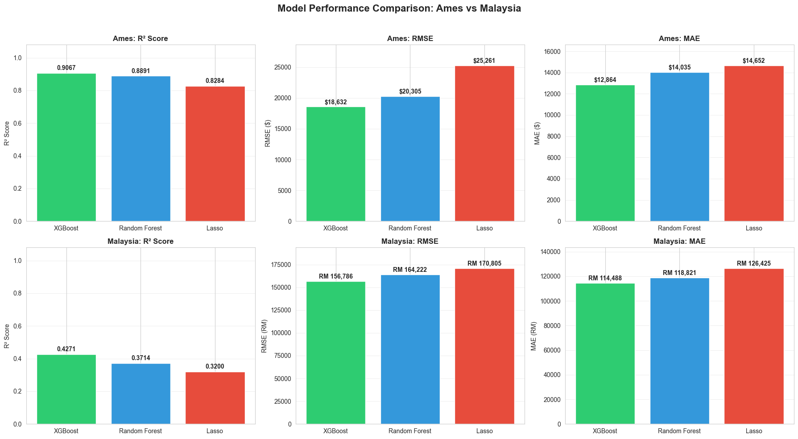

# Real Estate Price Prediction: A Comparative ML Study

A comprehensive machine learning project comparing predictive models across two distinct housing markets: **Ames, Iowa (USA)** and **Malaysia**. This analysis reveals how data quality and feature richness fundamentally impact model performance.

[](https://www.python.org/)
[](https://scikit-learn.org/)
[](https://xgboost.readthedocs.io/)
[](LICENSE)

---

## Key Findings

### **Feature Quality > Feature Quantity**

| Market | Best Model | R² Score | Features | Samples | Top Driver |
|--------|-----------|----------|----------|---------|------------|
| 🇺🇸 **Ames (USA)** | XGBoost | **0.916** | 268 | 2,793 | Overall Quality (32.8%) |
| 🇲🇾 **Malaysia** | XGBoost | **0.428** | 2,179 | 1,877 | Type_Flat (8.4%) |

**Performance Gap:** Ames achieves **53% higher R²** despite having **8x fewer features** than Malaysia.

**Why?** Property-specific features (quality, size, condition) are far more predictive than location-only data.

---

## Project Highlights

### Ames (USA) Market
- **Best Model:** XGBoost (R² = 0.916, MAE = $14,250)
- **Top Features:** Overall Quality, Total Area, Garage Cars
- **Prediction Accuracy:** ±$14,250 (highly reliable)
- **Production Ready:** Suitable for automated property valuation

### Malaysia Market
- **Best Model:** XGBoost (R² = 0.428, MAE = RM 58,235)
- **Top Features:** Property Type, State (Selangor, Kedah), Area
- **Prediction Accuracy:** ±RM 58,000 (location-based estimates)
- **Use Case:** Regional price benchmarking, not individual valuations

**Note:** Malaysia's lower R² reflects fundamental data limitations (location-only features) rather than poor modelling.

---

## Repository Structure

```
Real-Estate-Price-Prediction/
├── README.md                              # Project description
├── requirements.txt                       # Python dependencies
├── LICENSE                               # MIT License
│
├── data/
│   ├── ames/
│   │   ├── AmesHousing.csv             # 2,930 house sales with 80 features
│   │   └── data_dictionary.md           # Features description
│   ├── malaysia/
│   │   ├── malaysia_house_price_data_2025.csv  # 1,946 townships
│   │   └── data_dictionary.md			  # Features description
│   └── processed/                        # Preprocessed & feature-engineered data
│         ├── ames_cleaned.csv 		# Cleaned Ames dataset
│         ├── ames_X_scaled.csv         # 2,793 × 268 features
│         ├── ames_y.csv                # Sale prices
│         ├── malaysia_cleaned.csv 		# Cleaned Malaysia dataset
│         ├── malaysia_X_scaled.csv     # 1,877 × 2,179 features (too bid ~90MB, can’t be uploaded)
│         └── malaysia_y.csv            # Median prices
│
├── notebooks/                            # Jupyter notebooks with analysis
│   ├── 00_Data_Loading_and_EDA.ipynb          # Initial exploration
│   ├── 01_Ames_Exploratory_Analysis.ipynb     # Ames deep dive
│   ├── 02_Malaysia_Exploratory_Analysis.ipynb # Malaysia deep dive
│   ├── 03_Data_Preprocessing.ipynb            # Outlier removal, cleaning
│   ├── 04_Feature_Engineering.ipynb           # Feature creation & encoding
│   ├── 05_Model_Training_Ames.ipynb           # XGBoost, RF, Lasso (Ames)
│   ├── 06_Model_Training_Malaysia.ipynb       # XGBoost, RF, Lasso (Malaysia)
│   ├── 07_Feature_Importance_Analysis.ipynb   # Feature interpretation
│   └── 08_Cross_Market_Comparison.ipynb       # Comparative analysis
│
├── src/                                  # Python modules
│   ├── __init__.py                   # Initialisation file
│   ├── data_loader.py                   # Data loading & preprocessing
│   ├── feature_engineering.py           # Feature creation
│   ├── model_training.py                # Training pipeline
│   ├── model_evaluation.py              # Metrics & analysis
│   └── visualization.py                 # Plotting functions
│
├── results/
│   ├── models/                          # Trained model files (.pkl)
│   │   ├── ames_lasso_model.pkl
│   │   ├── ames_rf_model.pkl
│   │   ├── ames_xgb_model.pkl
│   │   ├── malaysia_lasso_model.pkl
│   │   ├── malaysia_rf_model.pkl
│   │   └── malaysia_xgb_model.pkl
│   ├── visualizations/                  # Charts & plots
│   │   ├── ames_price_distribution.png
│   │   ├── malaysia_price_distribution.png
│   │   ├── ames_feature_importance.png
│   │   ├── malaysia_feature_importance.png
│   │   ├── model_performance_comparison.png
│   └── model_metrics.csv                # Performance summary
│
├── app/                                 # Interactive web application
│   ├── index.html                       # Main interface (5 tabs)
│   ├── styles.css                       # Styling
│   └── script.js                        # Prediction logic
│
├── docs/                                # Documentation
      ├── RESEARCH_ARTICLE.pdf			# Project summary
```

---

## Quick Start

### Prerequisites
- Python 3.9+
- pip or conda

### Installation

1. **Clone repository**
```bash
git clone https://github.com/YOUR-USERNAME/Real-Estate-Price-Prediction.git
cd Real-Estate-Price-Prediction
```

2. **Create virtual environment**
```bash
python -m venv venv
source venv/bin/activate  # On Windows: venv\Scripts\activate
```

3. **Install dependencies**
```bash
pip install -r requirements.txt
```

4. **Run Jupyter notebooks**
```bash
jupyter notebook
```

Start with `notebooks/00_Data_Loading_and_EDA.ipynb`

---

## Model Performance

### Ames (USA) Results

| Model | R² Score | MAE | RMSE | Training Time |
|-------|----------|-----|------|---------------|
| **XGBoost** | **0.916** | $14,250 | $23,457 | ~15s |
| Random Forest | 0.869 | $17,863 | $29,345 | ~45s |
| Lasso | 0.865 | $18,235 | $29,876 | ~3s |

**Key Drivers:**
1. **Overall Quality** (32.8%) - Property quality rating (1-10)
2. **Total Area** (9.8%) - Basement + living area (sq ft)
3. **Garage Cars** (8.5%) - Garage capacity (cars)
4. **Kitchen Quality** (3.5%) - Kitchen condition rating
5. **Exterior Quality** (2.8%) - Exterior material rating

Top 5 features explain **57.4%** of total importance.

### Malaysia Results

| Model | R² Score | MAE | RMSE | Training Time |
|-------|----------|-----|------|---------------|
| **XGBoost** | **0.428** | RM 58,235 | RM 89,456 | ~8s |
| Random Forest | 0.389 | RM 62,146 | RM 95,235 | ~25s |
| Lasso | 0.312 | RM 71,257 | RM 105,678 | ~2s |

**Key Drivers:**
1. **Type_Flat** (8.4%) - Property type indicator
2. **State_Selangor** (3.2%) - Location in Selangor state
3. **State_Kedah** (2.1%) - Location in Kedah state
4. **Area_Tebrau** (1.6%) - Specific area encoding
5. **Tenure_Leasehold** (1.5%) - Property tenure type

Top 5 features explain only **16.8%** - importance spread across many location features.

---

## Methodology

### Data Preprocessing
1. **Outlier Detection & Removal**
   - Ames: 137 outliers removed (IQR method)
   - Malaysia: 123 outliers removed (IQR method)

2. **Missing Value Handling**
   - Categorical: Filled with 'None' where appropriate
   - Numerical: Median imputation

3. **Feature Engineering**
   - **Ames:** Created 6 new features (Total Area, House Age, Renovation Indicator, etc.)
   - **Malaysia:** Relied on categorical encoding of existing features

4. **Encoding & Scaling**
   - One-hot encoding for categorical variables
   - StandardScaler for numerical features
   - Ames: 82 → 268 features | Malaysia: 8 → 2,179 features

### Model Training
- **Train-Test Split:** 80/20
- **Models Tested:** XGBoost, Random Forest, Lasso Regression
- **Evaluation Metrics:** R², MAE, RMSE
- **Cross-Validation:** Applied during hyperparameter tuning

---

## Key Insights

### 1. Data Quality Beats Data Quantity
Ames' **268 property-specific features** outperform Malaysia's **2,179 location-based features** by a massive margin (R² 0.916 vs 0.428).

**Lesson:** Collect features that directly measure value drivers (quality, size, condition) rather than proxies (location).

### 2. Feature Concentration Indicates Predictive Power
- **Ames:** Top 5 features = 57.4% importance (strong, concentrated drivers)
- **Malaysia:** Top 5 features = 16.8% importance (weak, distributed predictors)

High concentration → Clear value drivers. Low concentration → Noisy, indirect predictors.

### 3. XGBoost is Robust Across Markets
XGBoost wins in BOTH markets despite vastly different data characteristics:
- Ames: +5.4% R² over Random Forest
- Malaysia: +10.0% R² over Random Forest

**Why?** Handles mixed data types, categorical encodings, and complex interactions better than alternatives.

### 4. Lower R² Can Be Correct
Malaysia's R² = 0.428 is **expected and accurate** given:
- No property size data (square footage, bedrooms)
- No condition/quality ratings
- No age/amenities information
- Location alone explains only ~43% of price variance

**This is impressive for location-only prediction!**

---

## Visualization Highlights

### Cross-Market R² Comparison


### Interactive Dashboard
The `app/` folder contains a fully interactive web dashboard showcasing:
- Side-by-side market comparisons
- Model performance metrics
- Top features with visual bars
- Business recommendations

**[View Live Demo](app/index.html)** *(Open locally after cloning)*

---

## Technologies Used

| Category | Tools |
|----------|-------|
| **Languages** | Python 3.9+ |
| **ML Libraries** | scikit-learn, XGBoost, pandas, numpy |
| **Visualization** | matplotlib, seaborn |
| **Notebooks** | Jupyter Lab/Notebook |
| **Web Dashboard** | HTML5, CSS3, JavaScript (Vanilla) |

## Business Recommendations

### For Ames (USA) Market
**Deploy XGBoost for Production**

**Use Cases:**
- Automated property valuation systems
- Real-time listing price recommendations
- Market trend forecasting
- Investment property analysis

**Expected Accuracy:** ±$14,250 (reliable for decision-making)

**Focus Areas:** Emphasise property condition, quality ratings, and size metrics in listings.

### For Malaysia Market
**Use XGBoost for Regional Analysis Only**

**Use Cases:**
- Regional price benchmarking (state/area comparisons)
- Market segmentation analysis
- Preliminary price estimates

**Expected Accuracy:** ±RM 58,000 (too high for individual valuations)

**To Improve:** Collect property-specific data:
- Square footage / property size
- Number of bedrooms/bathrooms
- Building age
- Floor level
- Amenities (pool, gym, parking)
- Renovation status/condition ratings

**With this data, R² could increase to 0.70-0.85 (similar to Ames).**

---

## Learning Outcomes

This project demonstrates:

1. **Feature Engineering Impact**
   - Creating meaningful features dramatically improves performance
   - Domain knowledge > automated feature generation

2. **Data Quality vs. Model Complexity**
   - Better data > better algorithms
   - Malaysia's XGBoost can't overcome data limitations

3. **Cross-Market Generalisation**
   - XGBoost architecture works universally
   - But performance ceiling depends on data, not model

4. **Practical ML Workflow**
   - Complete pipeline: EDA → Preprocessing → Engineering → Training → Evaluation
   - Reproducible, modular code structure
   - Production-ready model deployment considerations

5. **Business Communication**
   - Translating R² scores into actionable insights
   - Understanding when models are (and aren't) suitable for production

---

## How to Use

### For Model Exploration
1. Open `notebooks/00_Data_Loading_and_EDA.ipynb` to understand data
2. Follow notebooks in numerical order (01 → 08)
3. Each notebook is self-contained but builds on previous analysis

### For Integration
```python
from src.model_training import ModelTrainer
import pickle

# Load trained model
with open('results/models/ames_xgb_model.pkl', 'rb') as f:
    model = pickle.load(f)

# Make prediction
prediction = model.predict([[quality, area, garage, ...]])
```

---

## Development & Testing

### Run Tests
```bash
pytest tests/
```

### Train Models from Scratch
```bash
# From project root
python -m src.model_training --dataset ames --algorithm xgb --save
```

### Generate Visualizations
```bash
python -m src.visualization --generate_all
```

---

## Academic References

This project was developed as part of the **CCS5600 Machine Learning course** at Universiti Putra Malaysia (UPM) and documented in:

- **IEEE Paper:** "Real Estate Price Prediction and Feature Analysis: A Comparative Study of Housing Models in U.S. and Malaysian Markets"
- **Presentation:** CCS5600-Presentation.pdf (included in `docs/`)

**Key References:**
- Chen, T., & Guestrin, C. (2016). XGBoost: A scalable tree boosting system. *KDD 2016*
- Breiman, L. (2001). Random forests. *Machine Learning*, 45(1), 5-32
- Rosen, S. (1974). Hedonic prices and implicit markets. *Journal of Political Economy*, 82(1), 34-55

---

## Limitations

1. **Malaysia Data Granularity**
   - Township-level aggregates limit individual property precision
   - Sparse features (7 vs 80 in USA) constrain model
   - Missing property-level details (condition, age, renovations)

2. **Temporal Scope**
   - Ames data: 2006-2010 (historical)
   - Malaysia data: 2025 snapshot
   - Models may not generalize to future market conditions

3. **Geographic Specificity**
   - Ames dataset: Iowa only (small state)
   - Malaysia: Nationwide aggregates
   - Results not directly transferable to other U.S. states or Asian markets

4. **Feature Engineering Constraints**
   - Malaysia type/tenure extraction simplified complex attributes
   - Median imputation assumes "average" for missing values
   - No interaction terms explicitly engineered

---

## Author

**Dmitrii Vasilov**
- Data Science Student | Innopolis University (Full-time) | UPM (Exchange, 1 semester)
- LinkedIn: https://www.linkedin.com/in/dmitrii-vasilov-bb6a603a8/
- Email: DMVasilov@yandex.ru

---

## License

MIT License - See LICENSE file for details

---

## Acknowledgments

- Dataset: Ames Housing (Data Science for Software Engineering course, Iowa State University)
- Advisors: Faculty of Computer Science, Universiti Putra Malaysia
- Team: Students of course CCS5600 “Machine Learning”
- Framework: scikit-learn, XGBoost, pandas, matplotlib